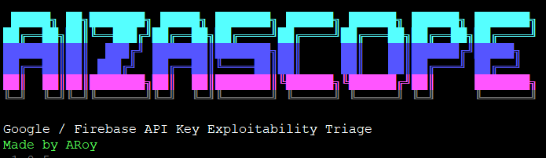

<p align="center">
  
</p>

<h1 align="center">AizaScope</h1>

<p align="center">
  <strong>Google / Firebase API Key Exploitability Triage for Authorized Security Testing</strong>
</p>

<p align="center">
  <em>Made by ARoy</em>
</p>


# AizaScope

<p align="center">
  <strong>Google & Firebase AIza API-key exploitability triage for authorized security testing</strong>
</p>

<p align="center">
  <em>Made by ARoy</em>
</p>

<p align="center">
  <a href="#installation">Installation</a> ·
  <a href="#quick-start">Quick Start</a> ·
  <a href="#what-it-checks">What It Checks</a> ·
  <a href="#output">Output</a> ·
  <a href="#responsible-use">Responsible Use</a>
</p>

---

## Overview

AizaScope is a Python CLI tool for security researchers, bug bounty hunters, and application security teams who need to validate the real-world impact of exposed Google/Firebase `AIza...` API keys.

It does **not** treat Firebase API-key exposure as a vulnerability by itself. Instead, AizaScope checks whether a discovered key can actually access backend data, misconfigured Firebase services, billable Google APIs, or unintended API surfaces.

AizaScope accepts either:

- a single `AIza...` key; or
- a TXT file containing one `AIza...` key per line.

It then produces clean terminal output, JSONL evidence, markdown report scaffolding, attack-chain notes, and ready-to-run PoC commands for actionable findings.

---

## Key Features

- Single-key and bulk-key scanning
- Firebase project/config resolution
- Firestore read/list and `listCollectionIds` probes
- Realtime Database shallow-read probes
- Firebase Storage bucket and prefix listing probes
- Gemini / Generative Language API checks
- YouTube Data API access and restriction checks
- Google Maps Platform checks
- Google Cloud AI API checks
- Safe Browsing API callable checks
- Clean terminal output for actionable findings
- Ready-to-run PoC command generation
- JSONL evidence logging
- Markdown advisory and attack-chain reports
- Resume support for interrupted scans
- Strict opt-in marker write/delete proof with `--prove-write`

---

## Installation

AizaScope is a normal Python package. No custom installer script is required.

### Linux / macOS

```bash
git clone https://github.com/arkadeep-roy/AizaScope.git
cd AizaScope

python3 -m venv .venv
source .venv/bin/activate

python -m pip install --upgrade pip setuptools wheel
python -m pip install -e .
```

Verify the installation:

```bash
aizascope --version
```
---
## Quick Start

### Scan a single key

```bash
aizascope --key=AIzaYOURKEYHERE
```

You can also pass the key as a positional argument:

```bash
aizascope AIzaYOURKEYHERE
```

Single-key scans print only actionable `MEDIUM`, `HIGH`, and `CRITICAL` findings in the terminal. When a finding has a PoC, AizaScope prints the ready-to-run command directly with the provided key embedded.

### Scan a file of keys

Create a TXT file with one key per line:

```text
AIza...
AIza...
AIza...
```

Run:

```bash
aizascope keys.txt
```

For bulk scans, AizaScope writes structured results to the output directory.

### Resume an interrupted scan

```bash
aizascope keys.txt --resume
```

### Quick low-cost scan

```bash
aizascope keys.txt --quick
```

### Passive metadata/read-only scan

```bash
aizascope keys.txt --passive
```

### Show built-in probe candidates

```bash
aizascope --show-probe-wordlists
```

---

## What It Checks

Default full mode runs a broad no-prompt probe matrix across Google and Firebase services.

| Area | Checks |
|---|---|
| Firebase Config | project/config resolution |
| Firestore | collection read/list probes, `listCollectionIds` |
| Realtime Database | shallow root reads |
| Firebase Storage | bucket listing and prefix listing |
| Gemini | models, files, cached contents, batches, token/generation/embed checks |
| YouTube Data API | public-data access, referrer behavior, OAuth-only negative controls |
| Maps Platform | Maps JavaScript, Geocoding, Static Maps, Places, Directions, Distance Matrix, Time Zone, Geolocation |
| Cloud AI | Vision, Translation, Natural Language |
| Safe Browsing | `threatMatches.find` API-callable check |

### Important: Firebase key exposure alone

AizaScope does not report Firebase API-key exposure as a vulnerability by itself. A key-only finding is treated as informational unless the scan confirms real exploitability, such as:

- Firestore documents or collection IDs exposed;
- RTDB shallow-read exposure;
- Firebase Storage listing exposure;
- unrestricted/billable Google API access;
- non-empty metadata exposure from relevant API surfaces;
- confirmed marker write/delete proof after explicit opt-in.

---

## Firestore and Storage Probe Candidates

AizaScope includes built-in probe candidates for common Firestore collections and Storage prefixes. This is intentional because Firebase projects usually do not reveal collection names unless `listCollectionIds` is open or a guessed collection is readable.

Probe candidates are **not findings**.

AizaScope only reports a finding when the target returns positive evidence, such as:

- HTTP `200` from a Firestore collection-list request;
- non-empty `documents[]` with `pageSize=1`;
- exposed collection names from `listCollectionIds`;
- Firebase Storage `items[]` or `prefixes[]`.

To see the exact live wordlist used by your installed version:

```bash
aizascope --show-probe-wordlists
```

---

## Write Proof

AizaScope is non-mutating by default. It does not write, upload, or delete anything unless you explicitly enable marker write proof.

Enable write proof only when authorized:

```bash
aizascope keys.txt --prove-write
aizascope --key=AIzaYOURKEYHERE --prove-write
```

`--prove-write` attempts temporary marker write/delete only after read/list exposure is confirmed.

Marker paths:

```text
Firestore: aizascope_bbp_probe/<nonce>
RTDB     : /aizascope_bbp_probe/<nonce>.json
Storage  : aizascope_bbp_probe/<nonce>.txt
```

Use this only when the target program explicitly permits write testing.

---

## Output

Default output directory:

```text
aizascope_results/
```

Typical files:

```text
findings.jsonl              complete raw evidence log
summary.json                counts by priority, service, and classification
proof_commands.json         ready-to-run PoC commands for actionable findings
invalid_keys.txt            invalid input lines, when present
scan_state.json             resume state
attack_chains.json          structured chain analysis
reports/advisory.md         markdown advisory scaffold
reports/attack_chains.md    markdown chain notes
poc/curl_pocs.sh            curl PoC commands for actionable findings
```

### Terminal Output Policy

AizaScope keeps the terminal focused:

- single-key scans print only actionable `MEDIUM`, `HIGH`, and `CRITICAL` findings;
- single-key scans print PoC commands directly in the terminal when available;
- bulk scans write PoC commands to `proof_commands.json` and `poc/curl_pocs.sh`;
- `INFO`, `LOW`, `REVIEW`, blocked, restricted, expected, request-denied, and allowed-empty records remain in `findings.jsonl` for audit/debugging.

Use:

```bash
aizascope keys.txt --min-priority HIGH
```

to show only high-impact terminal findings.

Use:

```bash
aizascope keys.txt --jsonl-stdout
```

to stream findings for automation.

---

## Severity Model

AizaScope uses evidence-based severity hints. Final severity depends on scope, data sensitivity, business context, and bug bounty program policy.

| Evidence | Typical Priority |
|---|---:|
| Firebase key only / config only | INFO |
| API callable but empty or non-sensitive metadata only | LOW |
| Billable API callable from unintended context | MEDIUM |
| Firestore / RTDB / Storage read/list exposure | MEDIUM |
| Non-empty Gemini file/cache/batch metadata exposure | MEDIUM / HIGH |
| Confirmed marker write/delete proof after read/list exposure | HIGH |
| Sensitive data, admin access, account takeover, destructive impact | Manual validation required |

AizaScope intentionally avoids claiming PII exposure, account takeover, or backend compromise unless the evidence supports it.

---

## Generated PoC Commands

PoC commands use `curl` and `python -m json.tool` for readable output. This avoids requiring `jq`.

Example:

```bash
curl -s 'https://example.googleapis.com/example?key=AIza...' | python -m json.tool
```

Generated PoC files may contain live API keys. Do not commit or share generated output without redaction.

---

## Development

Run the release checks before pushing changes:

```bash
python run_checks.py
```

This performs syntax checks, unit tests, CLI smoke checks, and read-only default behavior checks.

---

## Responsible Use

AizaScope is intended for authorized security testing, bug bounty research, and internal application security validation.

Only run AizaScope against assets where you have explicit permission to test. You are responsible for complying with all applicable laws, platform rules, and bug bounty program policies.

---

## License

MIT License. See [LICENSE](LICENSE).
